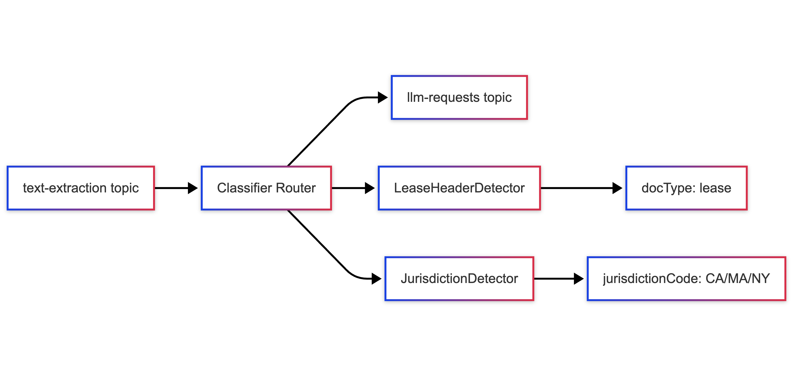

# Micro-Classifier: Document Classification & Routing Microservice

[](https://www.python.org/downloads/)
[](https://python-poetry.org/)
[](./tests/)


## 🏗️ **System Component Overview**


## 🏛️ **Architecture Details**

### **Package Structure**

```
classifier_router/
├── core/                   # Core classification logic
│   ├── detector/           # Detection strategies
│   │   ├── base.py         # Abstract detector interface
│   │   ├── lease_header.py # Lease document detection
│   │   └── jurisdiction.py # Jurisdiction detection
│   ├── factory.py          # Detector factory with config loading
│   ├── models.py           # Data models and results
│   └── router.py           # Main classification orchestrator
├── kafka/                  # Kafka integration
│   ├── processor.py        # Message processing logic
│   ├── schemas.py          # Pydantic message schemas
│   └── service.py          # Kafka consumer/producer service
├── config/                 # Configuration management
│   ├── config.py           # Detector configuration models
│   ├── logging_cfg.py      # Structured logging setup
│   └── settings.py         # Application settings
├── common/                 # Shared utilities
│   └── exceptions.py       # Custom exceptions
└── main.py                 # Application entry point
```

### **Key Components**

#### **ClassifierRouter**
- Orchestrates multiple detectors
- Handles failures gracefully
- Provides structured logging
- Supports selective detector execution

#### **DetectorStrategy Pattern**
- Abstract base class for all detectors
- Standardized `detect(text) -> DetectionResult` interface
- Easy to extend with new detection logic

#### **KafkaService**
- Async consumer/producer with aiokafka
- Batch message processing
- Graceful shutdown with signal handling
- Error recovery and retry logic

#### **MessageProcessor**
- Bridges async Kafka with sync classification
- Thread pool execution to avoid blocking
- Message validation and transformation
- Structured result formatting


## 🏗️ **System Overview**

The Micro-Classifier is a async microservice that serves as **Component #3** in an 8-component document processing pipeline. It:

- **Consumes** from `text-extraction` topic via Kafka
- **Detects** document types (lease, NDA, etc.) and jurisdiction codes (CA, MA, NY)
- **Produces** to `llm-requests` topic with classification metadata

### **Key Features**
- ✅ **Async Kafka Integration** - High-throughput message processing
- ✅ **Pluggable Detectors** - Configuration-driven detection strategies
- ✅ **Structured Logging** - Operational visibility and debugging
- ✅ **Comprehensive Testing** - 115 tests (99 unit tests, and 16 integration tests)
- ✅ **Clean Architecture** - Modular design with clear separation of concerns

## 🚧 **Current Status**

### **✅ Completed (Production-Ready Core)**
- [x] Core classification engine with detector pattern
- [x] Lease document detection (regex-based)
- [x] Jurisdiction detection (CA, MA, NY)
- [x] Configuration-driven detector factory
- [x] Async Kafka integration with consumer/producer
- [x] Structured logging with operational visibility
- [x] Comprehensive test suite (115 tests)
- [x] Clean package organization with absolute imports
- [x] Pydantic-based configuration management
- [x] Graceful shutdown and error handling

## 🚧 **Missing Components for Production**

### **Missing Features:**
- [ ] **Idempotency Store**: Redis-based duplicate prevention
- [ ] **Dead Letter Queues**: Failed message handling
- [ ] **Health Check Endpoints**: HTTP endpoints for K8s probes
- [ ] **Metrics Collection**: Prometheus metrics integration
- [ ] **Containerization**: Dockerfile and image building
- [ ] **CI/CD Pipeline**: Automated testing and deployment

### **Operational Enhancements:**
- [ ] **Security Scanning**: Vulnerability assessment
- [ ] **Performance Testing**: Load testing framework

---

## 📚 **Additional Documentations**
- **[docs/API.md](docs/API.md)** - API reference with classes and methods
- **[docs/Architecture.md](docs/Architecture.md)** - System design and component architecture  

---