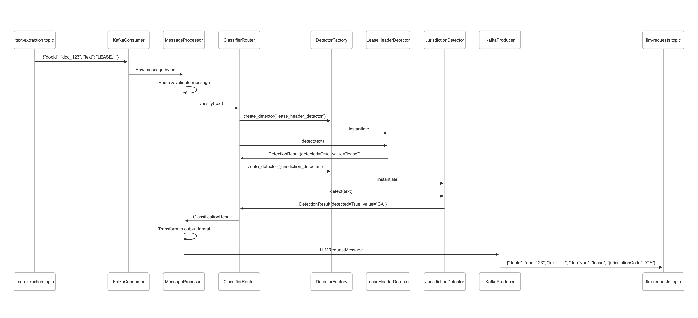

# Architecture Documentation

## 🏗️ **System Overview**

The Micro-Classifier is a production-ready async microservice designed as **Component #3** in an 8-component document processing pipeline. It bridges text extraction and LLM processing by classifying documents and detecting jurisdictions.

## 🔄 **Data Flow**


## 🏛️ **Component Architecture**

### **Layer 1: Kafka Integration**
- **KafkaService**: Main service orchestrator
- **MessageProcessor**: Message transformation and validation
- **Schemas**: Pydantic models for message validation

### **Layer 2: Core Classification**
- **ClassifierRouter**: Main orchestration logic
- **DetectorFactory**: Configuration-driven detector instantiation
- **Models**: Data structures for results

### **Layer 3: Detection Strategies**
- **DetectorStrategy**: Abstract base class
- **DocTypeDetector**: Document type detection
- **JurisdictionDetector**: Jurisdiction code detection

### **Layer 4: Configuration & Utilities**
- **Settings**: Environment-based configuration
- **Logging**: Structured logging with context
- **Exceptions**: Custom error types

## 🔧 **Design Patterns**

### **Strategy Pattern**
```python
class DetectorStrategy(ABC):
    @abstractmethod
    def detect(self, text: str) -> DetectionResult:
        pass
```
- Enables pluggable detection algorithms
- Easy to add new document types
- Consistent interface across detectors

### **Factory Pattern**
```python
class DetectorFactory:
    def create_detector(self, name: str) -> DetectorStrategy:
        # Dynamic instantiation from configuration
```
- Configuration-driven detector creation
- Runtime extensibility
- Dependency injection support

### **Async/Await Pattern**
```python
async def process_message(self, message_value: bytes) -> LLMRequestMessage:
    # Non-blocking message processing
```
- High-throughput message processing
- Graceful resource management
- Scalable concurrent operations

## 📊 **Data Models**

### **Input Schema**
```python
class TextExtractionMessage(BaseModel):
    docId: str
    text: str
```

### **Output Schema**
```python
class LLMRequestMessage(BaseModel):
    docId: str
    text: str
    docType: Optional[str]
    jurisdictionCode: Optional[str]
```

### **Internal Models**
```python
@dataclass
class DetectionResult:
    detected: bool
    value: Optional[str] = None

@dataclass
class ClassificationResult:
    text_length: int
    detector_results: Dict[str, DetectionResult]
    successful_detectors: Set[str]
    failed_detectors: Dict[str, str]
```

## 🔄 **Processing Pipeline**

### **Message Processing Flow**
1. **Consume**: Kafka consumer polls `text-extraction` topic
2. **Parse**: JSON deserialization and Pydantic validation
3. **Route**: Thread pool execution of classification logic
4. **Detect**: Run configured detectors against text
5. **Aggregate**: Combine results from all detectors
6. **Transform**: Map detector results to semantic output types
7. **Produce**: Send formatted message to `llm-requests` topic

### **Error Handling Strategy**
```python
try:
    result = await self.processor.process_message(message.value)
    await self._produce_message(result)
except Exception as e:
    self.logger.error("Processing failed", extra={
        "doc_id": message.key,
        "error": str(e)
    })
    # Continue processing other messages
```

## 🎯 **Configuration Management**

### **Environment-Based Settings**
```python
class KafkaSettings(BaseSettings):
    bootstrap_servers: List[str] = Field(default=["localhost:9092"])
    input_topic: str = Field(default="text-extraction")
    output_topic: str = Field(default="llm-requests")
    
    class Config:
        env_prefix = "KAFKA_"
```

### **Detector Configuration**
```json
{
    "detectors": [
        {
            "name": "lease_header_detector",
            "class_path": "classifier_router.core.detector.lease_header.LeaseHeaderDetector",
            "description": "Detects lease documents by header patterns",
            "output_type": "docType"
        }
    ]
}
```

## 🚀 **Scalability Considerations**

### **Horizontal Scaling**
- Kafka consumer groups enable multiple instances
- Stateless design allows easy replication
- Thread pool isolation prevents blocking

### **Performance Optimizations**
- Compiled regex patterns for fast matching
- Async processing with thread pools
- Batch message processing capabilities

### **Resource Management**
- Graceful shutdown with signal handling
- Connection pooling for external services
- Memory-efficient text processing (header-only scanning)

## 🔒 **Security Architecture**

### **Current Implementation**
- Input validation with Pydantic schemas
- Structured logging without sensitive data
- Error isolation and graceful degradation

### **Future Enhancements**
- TLS encryption for Kafka connections
- Message-level encryption for sensitive documents
- Audit logging for compliance

## 📈 **Monitoring & Observability**

### **Structured Logging**
```python
self.logger.info("Message processed successfully", extra={
    "doc_id": input_message.docId,
    "doc_type": output_message.docType,
    "jurisdiction_code": output_message.jurisdictionCode,
    "processing_time_ms": round(processing_time_ms, 2),
    "has_detections": metadata.has_detections,
})
```

### **Key Metrics**
- **Throughput**: Messages processed per second
- **Latency**: Processing time distribution
- **Error Rates**: Failed detections and processing errors
- **Resource Usage**: Memory and CPU utilization

## 🔮 **Future Architecture Evolution**

### **Planned Enhancements**
1. **Idempotency Store**: Redis-based duplicate prevention
2. **Dead Letter Queues**: Failed message handling
4. **Distributed Tracing**: End-to-end request tracking

### **Extensibility Points**
- New detector strategies via configuration
- Custom message transformations
- Pluggable storage backends
- Alternative messaging systems (SQS, RabbitMQ)

## 🧪 **Testing Strategy**

### **Unit Testing**
- Individual detector logic validation
- Configuration parsing and validation
- Error handling scenarios

### **Integration Testing**
- End-to-end message processing
- Kafka integration with mocked brokers
- Configuration-driven detector loading

### **Performance Testing**
- Message throughput benchmarks
- Memory usage profiling
- Concurrent processing validation

---